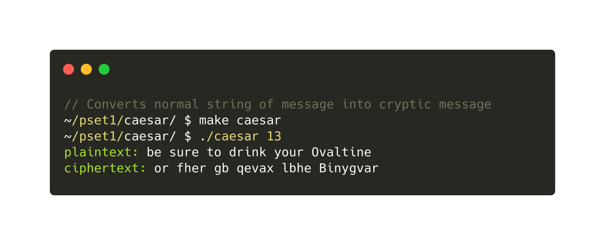

# **CS50x: Introduction to Computer Science**

  

Harvard's Introduction to the Intellectual Enterprises of Computer Science and the Art of Programming.

This course taught me how to think algorithmically and solve problems efficiently. Topics include abstraction, algorithms, data structures, encapsulation, resource management, security, software engineering, and web development. Languages include C, Python, SQL, and JavaScript plus CSS and HTML.

Problem sets inspired by real-world domains of biology, cryptography, finance, forensics, and gaming. Designed for majors and non-majors alike, with or without prior programming experience.

Visit CS50 on edX

https://www.edx.org/course/cs50s-introduction-to-computer-science

 Caesar

## Assignments and Problem Sets

> ### [**Problem Set 0**](/pset0)
- [Scratch Game](/pset0/scratch)
> ### [**Problem Set 1**](/pset1)
 - [Hello, World!](/pset1/hello.c)
 - [Mario Pyramid 1](/pset1/mario1.c)
 - [Mario Pyramid 2](/pset1/mario2.c)
 - [Cash](/pset1/cash.c)
 - [Credit](/pset1.credit.c)
 > ### [**Problem Set 2**](/pset2)
 - [Caesar](/pset1/caesar.c)
 
 ## Problem Sets

A summary of problem sets appears below

|Problem Set            |Topic  |Language|
|:----------------------|:-----:|:-------------:|
|[Problem Set 0](/pset0) |Scratch|Scratch|
|[Problem Set 1](/pset1) |C|C|
|[Problem Set 2](/pset2) |Crypto|C|
|[Problem Set 3](/pset3) |Game of Fifteen|C|
|[Problem Set 4](/pset4) |Forensics|C|
|[Problem Set 5](/pset5) |Misspellings|C|
|[Problem Set 6](/pset6) |Sentimental|Python|
|[Problem Set 7](/pset7) |C$50 Finance|Python, SQL|
|[Problem Set 8](/pset8) |Mashup|JavaScript|
|[Final Project](/final) |Any|Any|
